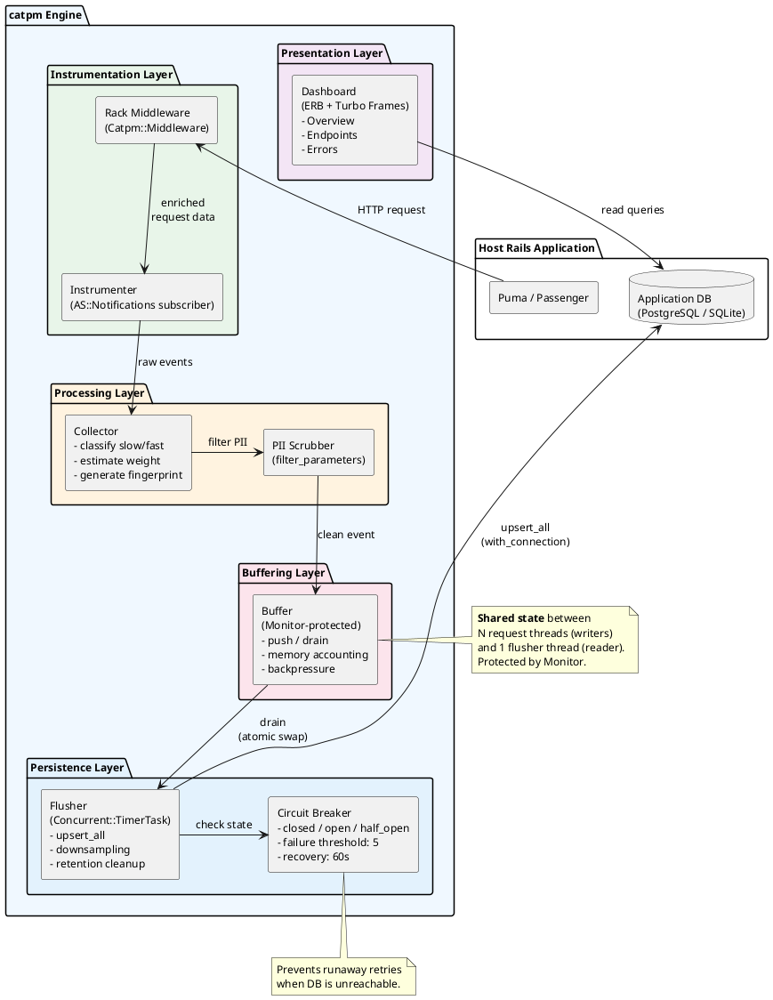
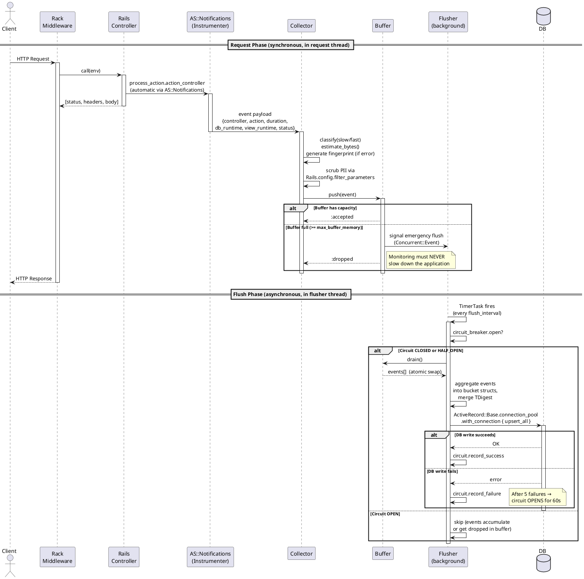
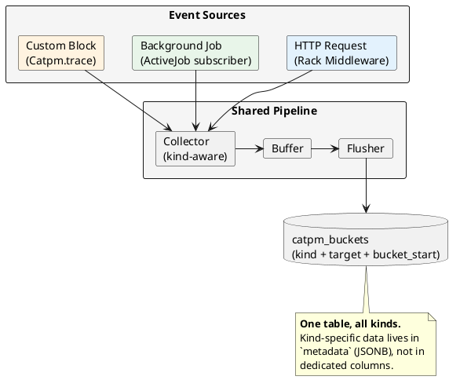
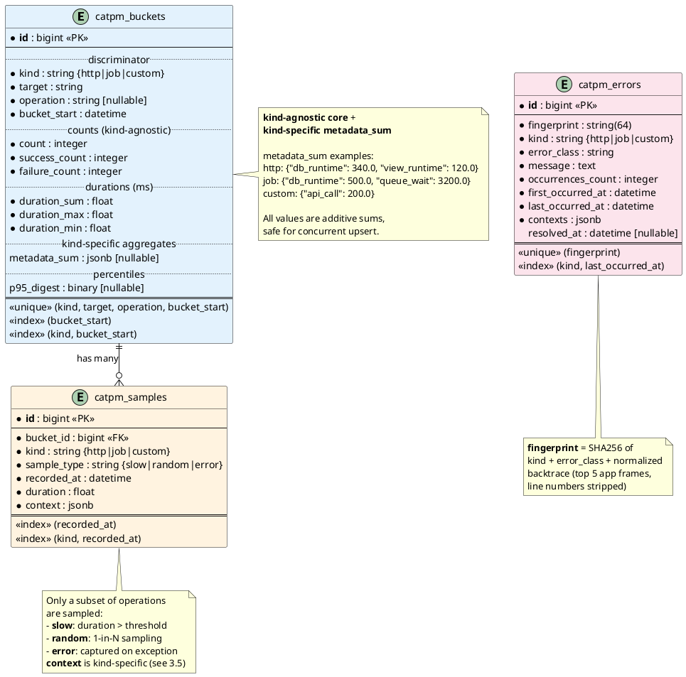
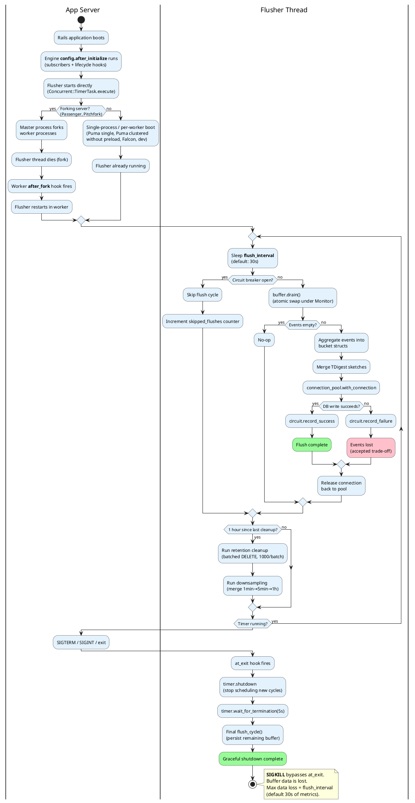
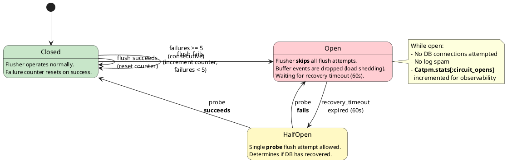
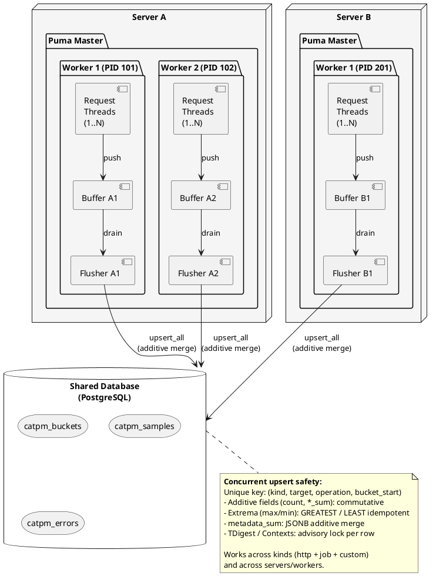
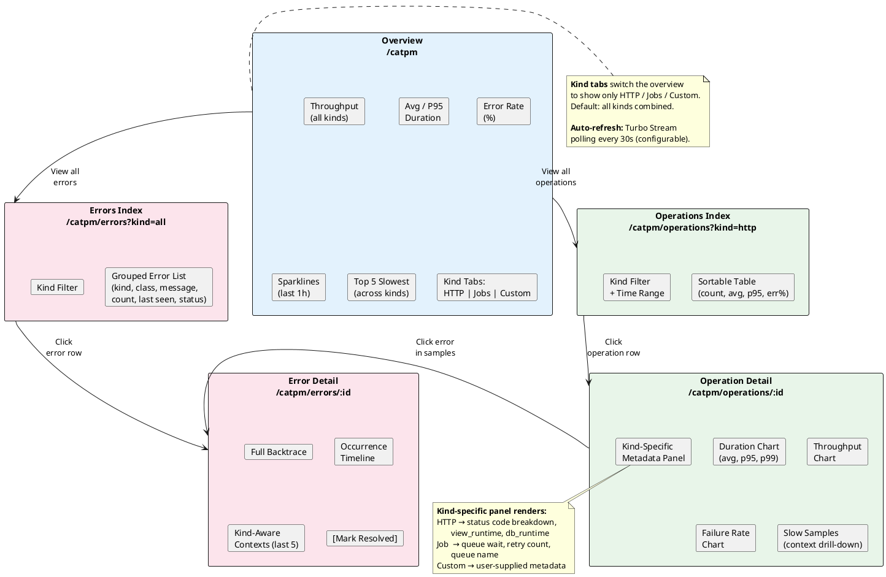

# Technical Design: catpm (Core Analytics & Tracking Performance Monitoring)

**Goal:** Create a mountable Rails Engine for performance and error monitoring with minimal resource consumption (RAM/CPU/Disk).

## 1. Concept and Goals

Most APM solutions (NewRelic, Datadog) are SaaS-oriented, while self-hosted alternatives (Elastic APM) require heavy infrastructure. **catpm** solves the monitoring problem for small to medium projects running on limited resources (e.g., Digital Ocean $4-10 tier).

### Key Principles:

*   **Zero-Dependency (almost):** No external gems beyond what Rails already provides (relies on `concurrent-ruby` and `ActiveSupport`, both shipped with Rails).
*   **No Redis:** Uses the existing application database via ActiveRecord.
*   **Aggregated-First:** Stores statistics by time intervals, not raw events.
*   **Memory-Aware:** Strict control over the in-memory buffer.

## 2. System Architecture

### 2.1. Components and Responsibilities

| Component | Responsibility |
| --- | --- |
| **Instrumenter** | Intercepts events via `ActiveSupport::Notifications` and Rack Middleware. |
| **Collector** | Initial processing: duration calculation, classification (slow/fast), fingerprint generation for errors. |
| **Buffer (In-Memory)** | Thread-safe temporary storage. Implements "Memory-Limited Queue" with backpressure. |
| **Flusher (Background)** | Periodic dumping of data from buffer to DB via `upsert_all`. Runs as a `Concurrent::TimerTask`. |
| **Storage** | Persistence layer using the host application's ActiveRecord connection. |

### 2.2. Component Diagram



### 2.3. Request Data Flow (Sequence)



### 2.4. Event Kinds

catpm is **not an HTTP-only monitor**. The data model is kind-agnostic — every tracked operation is classified by `kind`, which determines how it is instrumented, what metadata is captured, and how it is displayed on the dashboard.

| Kind | `kind` value | Target example | Instrumented via | Metadata examples |
| --- | --- | --- | --- | --- |
| **HTTP Request** | `http` | `UsersController#index` | Rack Middleware + AS::Notifications | `http_method`, `status`, `path`, `view_runtime` |
| **Background Job** | `job` | `SendEmailJob` | AS::Notifications (`perform.active_job`) | `queue`, `job_id`, `queue_wait`, `attempts` |
| **Custom Block** | `custom` | `PaymentProcessing` | `Catpm.trace` block API | user-defined key-value pairs |
| **Poller / Loop** | `custom` | `TelegramPoller#handle_update` | `Catpm.trace` block API | `update_type`, `chat_id`, etc. |

All kinds flow through the **same pipeline** (Collector → Buffer → Flusher → DB) and are stored in the **same tables**. The `kind` field acts as a discriminator; kind-specific details live in a JSONB `metadata` column rather than dedicated columns.



### 2.5. Instrumentation API

#### HTTP (automatic)

Zero-config. Enabled by the engine's Railtie. Captures `process_action.action_controller` events automatically.

#### Background Jobs (opt-in, one line)

```ruby
# config/initializers/catpm.rb
config.instrument_jobs = true  # subscribes to perform.active_job
```

This subscribes to `perform.active_job` via `ActiveSupport::Notifications`. Captured metadata: `queue`, `job_class`, `job_id`, `queue_wait` (enqueued_at → started_at), `attempts`. Works with any ActiveJob backend (Sidekiq, GoodJob, SolidQueue, Solid Queue).

#### Custom Traces (explicit)

For anything else — pollers, daemons, cron tasks, service objects:

```ruby
# Simple block
Catpm.trace("PaymentProcessing") do
  # Business logic...
end

# With metadata
Catpm.trace("TelegramPoller#handle_update", metadata: { update_type: "message", chat_id: 123 }) do
  process_update(update)
end

# Manual start/finish (for cases where a block doesn't fit)
span = Catpm.start_trace("LongRunningImport", metadata: { file: "users.csv" })
# ... work ...
span.finish  # or span.finish(error: e) to record failure
```

All traces — regardless of source — produce the same `Catpm::Event` struct and enter the common aggregation funnel.

#### Nested Spans (in-request waterfall)

Inside an HTTP request, use `Catpm.span` to create nested segments that appear as a parent-child waterfall (similar to Elastic APM). Any SQL queries, HTTP calls, or other segments recorded inside the block automatically become children of the span:

```ruby
# Usage inside a controller/service during HTTP request:
Catpm.span("PaymentService.process") do
  payment = Payment.create!(...)        # SQL segments become children
  Stripe::Charge.create(...)            # HTTP segments become children too
end
```

**Behavior:**
- **Inside request context** (`Thread.current[:catpm_request_segments]` present): Creates a segment with `push_span`/`pop_span`, establishing parent-child relationships via `parent_index`.
- **Outside request context**: Falls back to `Catpm.trace` behavior (creates a standalone event).
- Spans can be nested arbitrarily deep. The middleware automatically creates a root `:request` span wrapping the entire request.

### 2.5.1. Extended Auto-Instrumentation (Segment-Level)

Beyond SQL, views, and cache — catpm automatically instruments additional libraries to provide visibility into **what code runs inside each request**. Every additional segment type flows through the same `RequestSegments` collector, respects the same 50-segment cap, and adds **zero** memory overhead beyond what the existing architecture already accounts for.

#### Instrumentation Tiers

| Tier | Mechanism | Overhead | Activation |
| --- | --- | --- | --- |
| **Tier 0** (existing) | `ActiveSupport::Notifications` | ~1-5µs/event | Always on (sql, view, cache) |
| **Tier 1** (new) | `ActiveSupport::Notifications` | ~1-5µs/event | Always on when library is loaded |
| **Tier 2** (new) | `Module#prepend` on library class | ~1-5µs/call | Opt-in via config, auto-detected at boot |

**Tier 1** subscribers attach to notifications that Rails already emits — zero monkey-patching, zero risk. **Tier 2** patches are applied via `Module#prepend` and only when the target library is loaded in the host application.

#### Tier 1: Rails Notification Subscribers

These use the same `ActiveSupport::Notifications.subscribe` pattern as the existing SQL/view/cache subscribers. They fire only when the corresponding Rails component is loaded.

| Notification | Segment type | Detail | When present |
| --- | --- | --- | --- |
| `deliver.action_mailer` | `:mailer` | `"UserMailer#welcome to user@example.com"` | Action Mailer loaded |
| `service_upload.active_storage` | `:storage` | `"upload avatar.jpg (245 KB)"` | Active Storage loaded |
| `service_download.active_storage` | `:storage` | `"download avatar.jpg"` | Active Storage loaded |

**Implementation pattern** (identical to existing subscribers):

```ruby
# In SegmentSubscribers.subscribe!
if defined?(ActionMailer)
  @mailer_subscriber = ActiveSupport::Notifications.subscribe(
    "deliver.action_mailer"
  ) do |event|
    record_mailer_segment(event)
  end
end
```

These subscribers are **no-ops** if the corresponding Rails component is not loaded — they don't `require` anything, they simply check `defined?`.

#### Tier 2: Net::HTTP Outbound Calls

External HTTP calls (Stripe, Twilio, webhooks, REST APIs) are one of the most common sources of hidden latency. Most Ruby HTTP clients — Faraday, HTTParty, RestClient — use `Net::HTTP` under the hood, so a single patch covers them all.

*   **Opt-in:** Disabled by default, enabled via `config.instrument_net_http = true`.
*   **Auto-detected:** The patch is only applied if `Net::HTTP` is loaded. If the user enables it but the library is absent, catpm logs a warning and skips.
*   **Request-scoped:** The patch checks `Thread.current[:catpm_request_segments]` and is a pure no-op outside of HTTP request context (zero overhead for background jobs, console, or rake tasks).
*   **Minimal:** The prepended method calls `super` and records a segment — no behavior change, no exception swallowing.

| Library | Patched method | Segment type | Detail | Config flag |
| --- | --- | --- | --- | --- |
| `Net::HTTP` | `Net::HTTP#request` | `:http` | `"GET api.stripe.com/v1/charges (200)"` | `instrument_net_http` |

**Implementation:**

```ruby
module Catpm
  module Patches
    module NetHttp
      def request(req, body = nil, &block)
        segments = Thread.current[:catpm_request_segments]
        unless segments
          return super
        end

        start = Process.clock_gettime(Process::CLOCK_MONOTONIC)
        response = super
        duration = (Process.clock_gettime(Process::CLOCK_MONOTONIC) - start) * 1000.0

        detail = "#{req.method} #{@address}#{req.path} (#{response.code})"
        source = duration >= Catpm.config.segment_source_threshold ? Catpm::SegmentSubscribers.send(:extract_source_location) : nil

        segments.add(
          type: :http, duration: duration, detail: detail,
          source: source, started_at: start
        )

        response
      end
    end
  end
end
```

**Patch activation** (once at boot, during `config.after_initialize`):

```ruby
# lib/catpm/lifecycle.rb (within register_hooks)
def self.apply_patches
  if Catpm.config.instrument_net_http && defined?(::Net::HTTP)
    require "catpm/patches/net_http"
    ::Net::HTTP.prepend(Catpm::Patches::NetHttp)
  end
end
```

`Module#prepend` is irreversible, but the `Thread.current[:catpm_request_segments]` guard ensures the patch is a pure no-op when catpm is disabled or outside request context.

#### Memory Safety Proof

Extended instrumentation adds **zero additional memory pressure** beyond what the existing architecture already budgets:

| Concern | Guarantee |
| --- | --- |
| **Segments per request** | Same 50-segment cap (`config.max_segments_per_request`). New types compete with SQL/view/cache for slots — the slowest 50 segments win regardless of type. |
| **Per-segment size** | Identical structure: `{type, duration, detail, source?, offset?}`. An `:http` segment is the same ~100-300 bytes as a `:sql` segment. |
| **Summary counters** | Dynamic keys (`{type}_count`, `{type}_duration`) add ~16 bytes per active type per request. With 7 types max: 112 bytes — negligible vs 32 MB buffer budget. |
| **Buffer memory** | No change. Segments are part of the event's `context` hash, already accounted for in `estimated_bytes`. |
| **Patch overhead** | `Thread.current` lookup + `Process.clock_gettime` = ~1µs. `super` call is unmodified. No allocations on the fast path (no segment captured when collector is absent). |
| **DB storage** | No schema changes. New segment types are stored in the same `context` JSONB on `catpm_samples`. Summary counters merge into the same `metadata_sum` on `catpm_buckets`. |

**Worst-case analysis:** A request that triggers 200 SQL queries, 5 outbound HTTP calls, 2 mailer deliveries, and 3 view renders still stores only 50 segments. The summary accurately counts all 210 operations. Memory per request: unchanged.

### 2.6. Installation Strategy

To ensure a smooth "Day 1" experience, a single generator handles all setup:

```bash
bundle add catpm
rails generate catpm:install
rails db:migrate
```

The generator performs:
1. Copies migrations to `db/migrate/`.
2. Creates `config/initializers/catpm.rb` with commented defaults.
3. Injects `mount Catpm::Engine => "/catpm"` into `config/routes.rb`.

**Auto-Inject:** The engine automatically registers its Rack middleware and `ActiveSupport::Notifications` subscribers via a Railtie — no manual `include` or configuration required beyond the generator output.

## 3. Data Schema

To save space, we avoid storing every request. All tables use the `catpm_` prefix to avoid collisions with host application tables.

### Entity-Relationship Diagram



### 3.1. Table `catpm_buckets` (Metrics)

Stores aggregated data grouped by time intervals. The schema is **kind-agnostic** — the same table holds HTTP endpoints, background jobs, custom traces, and anything else.

| Column | Type | Description |
| --- | --- | --- |
| `id` | bigint | Primary key |
| `kind` | string | Event kind: `http`, `job`, `custom` |
| `target` | string | What was executed (see table below) |
| `operation` | string, nullable | Sub-classification within target (see table below) |
| `bucket_start` | datetime | Interval start, rounded to `bucket_size` (default: 1 minute) |
| `count` | integer | Total call count in this bucket |
| `success_count` | integer | Calls that completed without error |
| `failure_count` | integer | Calls that raised an exception or returned a failure status |
| `duration_sum` | float | Sum of durations (ms), for average calculation |
| `duration_max` | float | Peak duration in bucket |
| `duration_min` | float | Minimum duration in bucket |
| `metadata_sum` | jsonb, nullable | Kind-specific additive metrics (see 3.1.2) |
| `p95_digest` | binary, nullable | Serialized TDigest for p95 approximation (see 3.4) |

**Unique constraint:** `(kind, target, operation, bucket_start)` — used as the upsert conflict key.

**Indexes:**
*   `(bucket_start)` — retention cleanup and time-range queries.
*   `(kind, bucket_start)` — dashboard filtering by kind.

#### 3.1.1. `target` and `operation` Semantics Per Kind

| Kind | `target` | `operation` | Examples |
| --- | --- | --- | --- |
| `http` | Controller#action | HTTP method | target=`UsersController#index`, operation=`GET` |
| `job` | Job class name | Queue name | target=`SendEmailJob`, operation=`mailers` |
| `custom` | Trace name | `NULL` (or user-supplied) | target=`TelegramPoller#handle_update`, operation=`NULL` |

**Why not `http_method`?** The column `operation` is semantically generic: it's the "verb" or "channel" of the operation. For HTTP it's the method, for jobs it's the queue, for custom it's whatever the user decides. This avoids NULL columns that only make sense for one kind.

#### 3.1.2. `metadata_sum` — Kind-Specific Additive Metrics

Instead of dedicated columns like `db_runtime_sum` and `view_runtime_sum` (which are meaningless for non-HTTP kinds), kind-specific sub-timings are stored in a JSONB object. All values are **additive sums**, safe for concurrent upsert merging.

| Kind | `metadata_sum` example | Notes |
| --- | --- | --- |
| `http` | `{"db_runtime": 340.5, "view_runtime": 120.3, "status_2xx": 45, "status_4xx": 3, "status_5xx": 1}` | HTTP-specific: view rendering, status code breakdown |
| `job` | `{"db_runtime": 500.0, "queue_wait": 3200.0, "retries": 2}` | Job-specific: time spent waiting in queue, retry count |
| `custom` | `{"api_calls": 5, "api_runtime": 800.0}` | User-defined: whatever the trace passes in |

**Upsert merge for `metadata_sum`:** On conflict, JSONB values are merged additively in SQL:

```sql
-- PostgreSQL
metadata_sum = catpm_buckets.metadata_sum || jsonb_each_merge(excluded.metadata_sum)
-- Implemented as a helper function that sums numeric values per key
```

For databases without native JSONB merge (SQLite), the flusher performs the merge in Ruby before writing.

### 3.2. Table `catpm_samples` (Samples)

Detailed information about specific operations, retained for debugging. The `context` column is kind-aware — its structure depends on the `kind`.

| Column | Type | Description |
| --- | --- | --- |
| `id` | bigint | Primary key |
| `bucket_id` | bigint | FK to `catpm_buckets` |
| `kind` | string | Event kind (denormalized for efficient filtering) |
| `sample_type` | string | `slow` (threshold exceeded), `random` (1-in-N), or `error` (exception) |
| `recorded_at` | datetime | Timestamp of the original operation |
| `duration` | float | Total duration (ms) |
| `context` | jsonb | Kind-specific details (see 3.5) |

**Indexes:**
*   `(recorded_at)` — retention cleanup.
*   `(kind, recorded_at)` — dashboard filtering.

### 3.3. Table `catpm_errors` (Errors)

| Column | Type | Description |
| --- | --- | --- |
| `id` | bigint | Primary key |
| `fingerprint` | string(64) | SHA256 hex digest (see 3.3.1) |
| `kind` | string | Event kind where error originated |
| `error_class` | string | e.g. `ActiveRecord::RecordNotFound` |
| `message` | text | Error message (first occurrence) |
| `occurrences_count` | integer | Total occurrences |
| `last_occurred_at` | datetime | Timestamp of most recent occurrence |
| `contexts` | jsonb | Circular buffer of last 5 contexts (see 3.3.2) |
| `first_occurred_at` | datetime | Timestamp of first occurrence |
| `resolved_at` | datetime, nullable | `NULL` if unresolved; set via dashboard |

**Unique constraint:** `(fingerprint)` — used as upsert conflict key.

**Index:** `(kind, last_occurred_at)` — for dashboard filtering and ordering.

#### 3.3.1. Fingerprint Algorithm

```ruby
raw = "#{kind}:#{error_class}\n#{normalized_backtrace}"
fingerprint = Digest::SHA256.hexdigest(raw)
```

The `kind` is included in the fingerprint so that the same exception class raised in an HTTP request and in a background job produces **different** error groups — they have different context and likely different root causes.

**Backtrace normalization:**
1. Filter out lines not belonging to the host application (exclude gems, stdlib).
2. Take the first 5 application-level lines.
3. Strip line numbers (they change across deploys): `app/models/user.rb:42:in 'validate'` → `app/models/user.rb:in 'validate'`.
4. Join with `\n`.

#### 3.3.2. Contexts Circular Buffer

The `contexts` field stores a JSON array of up to `max_error_contexts` (default: 5) entries. The structure is **kind-aware**:

**HTTP error context:**
```json
{
  "occurred_at": "2025-06-01T12:00:00Z",
  "kind": "http",
  "operation": { "method": "POST", "path": "/checkout", "params": { "...filtered..." } },
  "backtrace": ["app/models/order.rb:in 'process'", "..."]
}
```

**Job error context:**
```json
{
  "occurred_at": "2025-06-01T12:00:00Z",
  "kind": "job",
  "operation": { "job_class": "SendEmailJob", "job_id": "abc-123", "queue": "mailers", "attempt": 3 },
  "backtrace": ["app/jobs/send_email_job.rb:in 'perform'", "..."]
}
```

**Custom error context:**
```json
{
  "occurred_at": "2025-06-01T12:00:00Z",
  "kind": "custom",
  "operation": { "target": "TelegramPoller#handle_update", "metadata": { "update_type": "message" } },
  "backtrace": ["app/services/telegram_poller.rb:in 'handle_update'", "..."]
}
```

On upsert, the flusher appends new contexts and trims the array to keep only the most recent N entries. This is done in Ruby before the upsert — the DB always receives the final array.

### 3.4. Sample `context` Schema Per Kind

The `context` JSONB column in `catpm_samples` carries kind-specific details. This is where the "full picture" lives for debugging — unlike `catpm_buckets` which stores only aggregates.

| Kind | `context` structure |
| --- | --- |
| `http` | `{ "method": "GET", "path": "/users/1", "status": 200, "params": {...}, "segments": [...], "segment_summary": {...}, "segments_capped": false }` |
| `job` | `{ "job_class": "SendEmailJob", "job_id": "abc-123", "queue": "mailers", "arguments": [...], "queue_wait": 320.5, "attempt": 1 }` |
| `custom` | `{ "target": "TelegramPoller#handle_update", "metadata": { "update_type": "message", "chat_id": 123 } }` |

The dashboard renders the context differently depending on `kind` — HTTP samples show request/response details with segment waterfall, job samples show queue/retry info, custom samples show user-supplied metadata.

#### 3.4.1. Request-Level Segment Tracking

HTTP samples include per-request **segments** — individual SQL queries, view renders, outbound HTTP calls, mailer deliveries, storage operations, and their source locations. This enables drill-down into what happened inside a specific request, similar to Elastic APM's transaction waterfall.

**Segment types:**

| Type | Source | Detail example |
| --- | --- | --- |
| `sql` | `sql.active_record` subscriber | `SELECT "users".* FROM "users" LIMIT 20` |
| `view` | `render_template/partial.action_view` subscriber | `app/views/users/index.html.erb` |
| `cache` | `cache_read/write.active_support` subscriber | `cache.read users/1 (hit)` |
| `mailer` | `deliver.action_mailer` subscriber | `UserMailer#welcome to user@example.com` |
| `storage` | `service_upload/download.active_storage` subscriber | `upload avatar.jpg (245 KB)` |
| `http` | `Net::HTTP#request` prepend patch (opt-in) | `GET api.stripe.com/v1/charges (200)` |
| `custom` | `Catpm.segment` API (manual) | User-defined label |

All segment types share the same data structure and compete for the same 50-segment pool (see Resource Constraints below).

**Segment structure in `context`:**

```json
{
  "method": "GET", "path": "/checkout", "status": 200,
  "segments": [
    {"type": "request", "duration": 150.0, "detail": "GET /checkout", "parent_index": null},
    {"type": "custom", "duration": 80.0, "detail": "PaymentService.process", "parent_index": 0},
    {"type": "sql", "duration": 2.3, "detail": "SELECT \"users\".* FROM \"users\" LIMIT 20", "parent_index": 1},
    {"type": "sql", "duration": 12.5, "detail": "SELECT \"orders\".* FROM ...", "source": "app/models/user.rb:42", "parent_index": 1},
    {"type": "http", "duration": 340.2, "detail": "POST api.stripe.com/v1/charges (200)", "source": "app/services/payment.rb:18", "parent_index": 1},
    {"type": "mailer", "duration": 45.0, "detail": "OrderMailer#confirmation to user@example.com", "parent_index": 0},
    {"type": "view", "duration": 8.3, "detail": "app/views/orders/show.html.erb", "parent_index": 0}
  ],
  "segment_summary": {"sql_count": 15, "sql_duration": 45.2, "view_count": 3, "view_duration": 12.8, "http_count": 1, "http_duration": 340.2, "mailer_count": 1, "mailer_duration": 45.0, "request_count": 1, "request_duration": 150.0},
  "segments_capped": false
}
```

**Dynamic summary counters:** The `segment_summary` uses dynamic keys (`{type}_count`, `{type}_duration`) rather than a fixed set. This means new segment types are automatically tracked in the summary without code changes to `RequestSegments`. The `metadata_sum` additive merge on `catpm_buckets` works identically — any numeric JSONB key is summed.

**How it works:**

1. Rack Middleware creates a `RequestSegments` collector in `Thread.current[:catpm_request_segments]`.
2. Subscribers fire during request processing and add segments to the collector:
   *   **Tier 0** (always on): `sql.active_record`, `render_template.action_view`, `render_partial.action_view`, `cache_read.active_support`, `cache_write.active_support`.
   *   **Tier 1** (auto-detected): `deliver.action_mailer`, `service_upload.active_storage`, `service_download.active_storage` — subscribed only when the corresponding Rails component is loaded.
   *   **Tier 2** (opt-in): `Net::HTTP#request` prepend — fires inline during the outbound call and records timing.
3. `process_action.action_controller` fires **after** all inner events. The Collector reads `Thread.current[:catpm_request_segments]`, merges segments into `context` (for samples) and summary counters into `metadata` (for bucket aggregation).
4. Middleware `ensure` block clears `Thread.current[:catpm_request_segments]`.

**Resource constraints:**

*   **Cap at 50 segments** per request (`config.max_segments_per_request`). When full, the fastest segment is replaced if the new one is slower. Summary counters are always accurate regardless of cap.
*   **Source location** (`caller_locations`) is only captured for segments exceeding `config.segment_source_threshold` (default: 5ms). `caller_locations` is expensive; skipping it for fast queries keeps overhead negligible.
*   **SQL truncated** to `config.max_sql_length` (default: 200 chars). SCHEMA and migration queries are filtered out.
*   **No PII risk** — SQL queries use Rails parameter binds (not inlined values), view details are just file paths.

**Bucket-level aggregation:** The `segment_summary` counters (`sql_count`, `sql_duration`, `view_count`, `view_duration`) are merged into `metadata_sum` on the bucket via the existing additive merge logic. This enables "on average, 15 SQL queries taking 45ms" at the endpoint level — no new tables or migrations needed.

**Self-exclusion:** Requests to catpm's own dashboard controllers (`Catpm::*`) are automatically excluded from tracking to avoid polluting data with monitoring overhead.

### 3.5. Percentile Tracking (TDigest)

Average duration (`duration_sum / count`) is misleading for bimodal distributions. To provide meaningful p50/p95/p99 metrics, each bucket maintains a **TDigest** sketch.

**Implementation:**
*   Use a minimal, dependency-free TDigest implementation (~150 LOC) bundled within the gem, based on the [t-digest paper by Ted Dunning](https://github.com/tdunning/t-digest).
*   The digest is serialized as a compact binary blob (typically 1-3 KB) stored in `p95_digest`.
*   On upsert, digests from the buffer and existing DB row are **merged** — TDigest supports lossless merging.
*   The dashboard queries the digest to extract p50, p95, p99 at read time.

**Trade-off:** Adds ~1-3 KB per bucket row. For 500 unique endpoints with 1-minute buckets over 7 days, this is roughly 500 × 10,080 × 2 KB ≈ 10 GB — too much. Therefore, bucket size should auto-scale with retention:

| Data age | Bucket size | Rationale |
| --- | --- | --- |
| < 1 hour | 1 minute | High resolution for recent data |
| 1 hour – 24 hours | 5 minutes | Good detail for same-day analysis |
| 1 day – 7 days | 1 hour | Overview trends |

The flusher handles **downsampling**: once per hour, it merges 1-minute buckets older than 1 hour into 5-minute buckets (TDigest merging makes this lossless for percentiles). Once per day, it merges 5-minute buckets older than 24 hours into 1-hour buckets.

## 4. Concurrency Model

This is the most critical section for correctness. `catpm` operates in a multi-threaded environment (Puma workers, background flusher thread) and must not introduce data races or deadlocks.

### 4.1. Buffer Thread Safety

The buffer is the shared state between request threads (writers) and the flusher thread (reader). It is protected by a `Monitor` (reentrant mutex):

```ruby
class Catpm::Buffer
  def initialize(max_bytes:)
    @monitor = Monitor.new
    @events = []
    @current_bytes = 0
    @max_bytes = max_bytes
  end

  # Called from request threads (Puma workers)
  def push(event)
    @monitor.synchronize do
      if @current_bytes + event.estimated_bytes > @max_bytes
        return :dropped  # Backpressure: signal load shedding
      end
      @events << event
      @current_bytes += event.estimated_bytes
      :accepted
    end
  end

  # Called from flusher thread — swaps out the buffer atomically
  def drain
    @monitor.synchronize do
      events = @events
      @events = []
      @current_bytes = 0
      events
    end
  end
end
```

**Key design decisions:**
*   **`Monitor` over `Mutex`:** `Monitor` is reentrant, preventing deadlocks if code accidentally nests synchronization calls.
*   **`drain` (swap) over `shift`/`pop`:** Instead of popping events one by one, the flusher atomically swaps the entire array. This minimizes lock contention — the lock is held for microseconds, not for the duration of DB writes.
*   **No condition variables:** Request threads never block waiting for space. They get an immediate `:dropped` signal. This ensures zero impact on response latency.

### 4.2. Backpressure Strategy

When the buffer is full (`current_bytes >= max_bytes`):

1. **First line of defense — emergency flush:** The flusher is notified immediately (via `Concurrent::Event`) to run an out-of-schedule flush.
2. **If flush is already running — load shedding:** New events are silently dropped. A counter (`Catpm.stats[:dropped_events]`) is incremented for observability.
3. **No retries from request threads.** The request thread returns immediately — monitoring must never slow down the application.

### 4.3. Memory Weight Estimation

Each event struct estimates its memory footprint:

```ruby
class Catpm::Event
  OBJECT_OVERHEAD = 40  # bytes, Ruby object header
  REF_SIZE = 8          # bytes, pointer on 64-bit

  def estimated_bytes
    OBJECT_OVERHEAD +
      (target.bytesize + REF_SIZE) +
      (operation&.bytesize || 0) +
      (payload ? payload.to_json.bytesize + REF_SIZE : 0) +
      64  # fixed numeric fields (duration, timestamps, etc.)
  end
end
```

This is a heuristic with ~15% margin of error. The `max_buffer_memory` config should be set conservatively (default: 32 MB, which typically holds 100k-300k events depending on payload size).

## 5. Thread Lifecycle & App Server Compatibility

### 5.1. Flusher Implementation

The flusher uses `Concurrent::TimerTask` from `concurrent-ruby` (bundled with Rails) instead of raw `Thread.new`:

```ruby
class Catpm::Flusher
  def initialize(interval:, buffer:)
    @buffer = buffer
    @circuit = Catpm::CircuitBreaker.new
    @timer = Concurrent::TimerTask.new(
      execution_interval: interval,
      run_now: false
    ) { flush_cycle }
  end

  def start
    @timer.execute
  end

  def stop(timeout: 5)
    @timer.shutdown
    @timer.wait_for_termination(timeout)
    flush_cycle  # Final flush on shutdown
  end

  private

  def flush_cycle
    return if @circuit.open?

    events = @buffer.drain
    return if events.empty?

    persist(events)
    @circuit.record_success
  rescue => e
    @circuit.record_failure
    Catpm.config.error_handler.call(e)
    # Events are lost — this is an accepted trade-off.
    # Retrying would risk unbounded memory growth.
  end
end
```

**Why `Concurrent::TimerTask`:**
*   Automatic interval-based execution.
*   Built-in error isolation (exceptions don't kill the thread).
*   Clean shutdown via `#shutdown` + `#wait_for_termination`.
*   Already a Rails dependency — zero added gems.

### 5.2. Flusher Lifecycle



### 5.3. App Server Integration

The flusher is started directly in `config.after_initialize`. For forking servers (Passenger, Pitchfork), additional after-fork hooks ensure the flusher restarts in each worker process (since threads do not survive `fork(2)`).

```ruby
# lib/catpm/engine.rb
module Catpm
  class Engine < ::Rails::Engine
    isolate_namespace Catpm

    initializer "catpm.middleware" do |app|
      app.middleware.insert_before 0, Catpm::Middleware
    end

    config.after_initialize do
      if Catpm.enabled?
        Catpm::Subscribers.subscribe!
        Catpm::Lifecycle.register_hooks
      end
    end
  end
end
```

```ruby
# lib/catpm/lifecycle.rb
module Catpm
  module Lifecycle
    def self.register_hooks
      return unless Catpm.enabled?

      initialize_buffer
      initialize_flusher

      # Always start the flusher in the current process.
      # For forking servers, also register post-fork hooks
      # so each worker restarts its own flusher.
      Catpm.flusher&.start

      if defined?(::PhusionPassenger)
        register_passenger_hook
      elsif defined?(::Pitchfork)
        register_pitchfork_hook
      end

      register_shutdown_hooks
    end

    def self.register_shutdown_hooks
      at_exit { Catpm.flusher&.stop(timeout: 5) }
    end
  end
end
```

**Why always start directly?**

*   **Puma single mode** (Rails 8 default: `workers: 0`): No forking — direct start is the only path.
*   **Puma clustered without `preload_app!`**: Each worker loads the app independently, so `config.after_initialize` runs per-worker and the flusher starts correctly in each.
*   **Puma clustered with `preload_app!`**: The flusher starts in the master process, but the thread dies after fork. Users must add `on_worker_boot { Catpm.flusher&.start }` to `config/puma.rb`. This is documented in the install generator output.
*   **Passenger / Pitchfork**: After-fork hooks are registered automatically — zero configuration needed.

**Note on `Puma::Plugin`:** Earlier designs used `Puma::Plugin.create` to hook into Puma's boot lifecycle. This does not work — Puma discovers plugins via `require "puma/plugin/xxx"` at load time, not via dynamic class creation at runtime. The direct-start approach is simpler and correct for all common deployment scenarios.

**Supported app servers:**

| Server | Mechanism | Notes |
| --- | --- | --- |
| **Puma** (single) | Direct start in `after_initialize` | Rails 8 default (`workers: 0`), zero config |
| **Puma** (clustered, no preload) | Direct start in `after_initialize` | Each worker loads app independently |
| **Puma** (clustered + `preload_app!`) | Manual `on_worker_boot` hook | Power-user config; documented in install generator |
| **Passenger** | Direct start + `on_event(:starting_worker_process)` | Automatic, zero config |
| **Pitchfork** | Direct start + `after_worker_fork` | Automatic, zero config |
| **Unicorn** | Direct start + manual `after_fork` | User adds `Catpm.flusher&.start` in `unicorn.rb` |
| **Falcon / single-process** | Direct start in `after_initialize` | No fork concerns |

### 5.4. Graceful Shutdown

On process termination (`SIGTERM`, `SIGINT`, or normal exit):

1. `at_exit` hook triggers `Catpm.flusher.stop(timeout: 5)`.
2. `stop` shuts down the `Concurrent::TimerTask` (no new cycles).
3. `stop` executes one final `flush_cycle` to persist buffered data.
4. If the final flush exceeds the timeout (DB is unresponsive), data in the buffer is lost — this is acceptable per the trade-off table.

**SIGKILL:** Cannot be intercepted. Data in the buffer is lost. This is documented as a known limitation.

## 6. Circuit Breaker (Flush Resilience)

If the database is down or slow, the flusher must not endlessly retry and accumulate errors in logs.

```ruby
class Catpm::CircuitBreaker
  FAILURE_THRESHOLD = 5
  RECOVERY_TIMEOUT = 60  # seconds

  def initialize
    @failures = 0
    @state = :closed       # :closed = normal, :open = failing, :half_open = probing
    @opened_at = nil
    @mutex = Mutex.new
  end

  def open?
    @mutex.synchronize do
      case @state
      when :closed
        false
      when :open
        if Time.now - @opened_at >= RECOVERY_TIMEOUT
          @state = :half_open
          false  # Allow one probe attempt
        else
          true
        end
      when :half_open
        false
      end
    end
  end

  def record_success
    @mutex.synchronize do
      @failures = 0
      @state = :closed
    end
  end

  def record_failure
    @mutex.synchronize do
      @failures += 1
      if @failures >= FAILURE_THRESHOLD
        @state = :open
        @opened_at = Time.now
        Catpm.config.error_handler.call(
          Catpm::CircuitOpenError.new("Flusher circuit opened after #{@failures} failures. Will retry in #{RECOVERY_TIMEOUT}s.")
        )
      end
    end
  end
end
```

**Behavior:**
*   After 5 consecutive flush failures → circuit **opens**. Flusher stops attempting writes. Events in the buffer are dropped (load shedding).
*   After 60 seconds → circuit enters **half-open**. One flush attempt is made.
*   If the probe succeeds → circuit **closes**, normal operation resumes.
*   If the probe fails → circuit re-opens for another 60 seconds.

This prevents log spam, excessive DB connection attempts, and thread hangs during outages.

### 6.1. Circuit Breaker State Diagram



## 7. Upsert Strategy & Multi-Process Correctness

### Multi-Process Deployment Diagram



### 7.1. Upsert Implementation

Multiple processes (Puma workers, multiple servers) flush to the same DB concurrently. The flush strategy differs by adapter.

**PostgreSQL path** — single `upsert_all` with server-side merge:

```ruby
Catpm::Bucket.upsert_all(
  batch,
  unique_by: [:kind, :target, :operation, :bucket_start],
  on_duplicate: Arel.sql(Catpm::Adapter.current.bucket_upsert_sql)
)
```

Where `bucket_upsert_sql` generates (see full variants in 7.3.2):

```sql
-- PostgreSQL
count = catpm_buckets.count + excluded.count,
success_count = catpm_buckets.success_count + excluded.success_count,
failure_count = catpm_buckets.failure_count + excluded.failure_count,
duration_sum = catpm_buckets.duration_sum + excluded.duration_sum,
duration_max = GREATEST(catpm_buckets.duration_max, excluded.duration_max),
duration_min = LEAST(catpm_buckets.duration_min, excluded.duration_min),
metadata_sum = catpm_merge_jsonb_sums(catpm_buckets.metadata_sum, excluded.metadata_sum),
p95_digest = excluded.p95_digest
```

**SQLite path** — read-modify-write within a single `BEGIN IMMEDIATE` transaction (see 7.3.4 for full implementation). No `upsert_all` — instead, the adapter reads existing rows, merges `metadata_sum` and `p95_digest` in Ruby, and writes back. The `IMMEDIATE` lock + `busy_timeout` + `flush_jitter` ensures safety across multiple workers (see 7.3.3).

**Correctness guarantees (both adapters):**

*   **Additive fields** (`count`, `success_count`, `failure_count`, `duration_sum`): `a + b` is commutative and associative — safe regardless of execution order.
*   **Extremum fields** (`duration_max`, `duration_min`): `GREATEST`/`MAX` and `LEAST`/`MIN` are idempotent and order-independent.
*   **`metadata_sum`:** JSONB values merged additively per key. PostgreSQL uses a server-side function; SQLite merges in Ruby.
*   **`p95_digest`:** Always merged in Ruby (TDigest binary merge). PostgreSQL wraps the read-merge-write in an advisory lock; SQLite relies on the `IMMEDIATE` transaction lock.

**PostgreSQL `catpm_merge_jsonb_sums` function** (installed via migration):

```sql
CREATE OR REPLACE FUNCTION catpm_merge_jsonb_sums(a jsonb, b jsonb)
RETURNS jsonb AS $$
  SELECT COALESCE(a, '{}'::jsonb) || (
    SELECT jsonb_object_agg(key, COALESCE((a ->> key)::numeric, 0) + value::numeric)
    FROM jsonb_each_text(COALESCE(b, '{}'::jsonb))
  );
$$ LANGUAGE sql IMMUTABLE;
```

This function is **not created** on SQLite/MySQL — the migration is conditional on adapter type.

### 7.2. Error Upsert

```ruby
Catpm::Error.upsert_all(
  error_batch,
  unique_by: [:fingerprint],
  on_duplicate: Arel.sql(<<~SQL)
    occurrences_count = catpm_errors.occurrences_count + excluded.occurrences_count,
    last_occurred_at = GREATEST(catpm_errors.last_occurred_at, excluded.last_occurred_at),
    contexts = excluded.contexts
  SQL
)
```

Note: `kind` is stored on the error record but is **not** part of the unique constraint — `fingerprint` already includes `kind` in its hash input (see 3.3.1), so same exception class in HTTP vs. job context produces different fingerprints naturally.

The `contexts` circular buffer is prepared in Ruby before the upsert: the flusher reads existing contexts, appends new ones, trims to `max_error_contexts`, then writes the final array. Same advisory lock strategy as TDigest to prevent lost updates.

### 7.3. DB Adapter Compatibility

SQLite is a **first-class citizen** — the target audience (small apps on $4-10 VPS, Rails 8 defaults) runs SQLite in production. Every SQL query catpm generates must work on SQLite without fallback hacks.

#### 7.3.1. Feature Compatibility Matrix

| Feature | PostgreSQL | MySQL 5.7+ | SQLite 3.45+ (Rails 8) |
| --- | --- | --- | --- |
| `upsert_all` | `ON CONFLICT ... DO UPDATE` | `ON DUPLICATE KEY UPDATE` | `ON CONFLICT ... DO UPDATE` |
| Max/Min on upsert | `GREATEST` / `LEAST` | `GREATEST` / `LEAST` | `MAX` / `MIN` |
| JSON storage | `jsonb` (binary, indexed) | `JSON` (validated) | `TEXT` + JSON functions (3.38+) |
| JSON merge on upsert | Custom PG function | Ruby pre-merge | Ruby pre-merge |
| Time bucketing | `EXTRACT(EPOCH FROM ...)` | `UNIX_TIMESTAMP(...)` | `strftime('%s', ...)` |
| Advisory locks | `pg_advisory_xact_lock` | `GET_LOCK` | N/A (implicit via single-writer) |
| Concurrent writes | Full | Full | Single-writer (see 7.3.3) |

#### 7.3.2. SQL Generation Per Adapter

The storage layer generates adapter-specific SQL via modules chosen at boot:

```ruby
# Adapter selection (lib/catpm/adapter.rb)
module Catpm::Adapter
  def self.current
    case ActiveRecord::Base.connection.adapter_name
    when /PostgreSQL/i then Catpm::Adapter::PostgreSQL
    when /Mysql2/i     then Catpm::Adapter::MySQL
    when /SQLite/i     then Catpm::Adapter::SQLite
    else raise Catpm::UnsupportedAdapter, ActiveRecord::Base.connection.adapter_name
    end
  end
end
```

**Upsert SQL differences:**

```ruby
# PostgreSQL adapter
module Catpm::Adapter::PostgreSQL
  def self.bucket_upsert_sql
    <<~SQL
      count = catpm_buckets.count + excluded.count,
      success_count = catpm_buckets.success_count + excluded.success_count,
      failure_count = catpm_buckets.failure_count + excluded.failure_count,
      duration_sum = catpm_buckets.duration_sum + excluded.duration_sum,
      duration_max = GREATEST(catpm_buckets.duration_max, excluded.duration_max),
      duration_min = LEAST(catpm_buckets.duration_min, excluded.duration_min),
      metadata_sum = catpm_merge_jsonb_sums(catpm_buckets.metadata_sum, excluded.metadata_sum),
      p95_digest = excluded.p95_digest
    SQL
  end
end

# SQLite adapter
module Catpm::Adapter::SQLite
  def self.bucket_upsert_sql
    <<~SQL
      count = catpm_buckets.count + excluded.count,
      success_count = catpm_buckets.success_count + excluded.success_count,
      failure_count = catpm_buckets.failure_count + excluded.failure_count,
      duration_sum = catpm_buckets.duration_sum + excluded.duration_sum,
      duration_max = MAX(catpm_buckets.duration_max, excluded.duration_max),
      duration_min = MIN(catpm_buckets.duration_min, excluded.duration_min),
      metadata_sum = excluded.metadata_sum,
      p95_digest = excluded.p95_digest
    SQL
    # metadata_sum and p95_digest are pre-merged in Ruby (see 7.3.4)
  end
end
```

**Time bucketing differences:**

```ruby
# PostgreSQL
scope :for_time_range, ->(start_time, end_time, interval_seconds) {
  where(bucket_start: start_time..end_time)
    .where("EXTRACT(EPOCH FROM bucket_start)::integer % ? = 0", interval_seconds)
}

# SQLite
scope :for_time_range, ->(start_time, end_time, interval_seconds) {
  where(bucket_start: start_time..end_time)
    .where("CAST(strftime('%s', bucket_start) AS INTEGER) % ? = 0", interval_seconds)
}
```

#### 7.3.3. SQLite Concurrency: The Single-Writer Problem

SQLite allows **one writer at a time**. In WAL mode (default since Rails 7.1), readers don't block writers and vice versa, but two simultaneous writes → one gets `SQLITE_BUSY`.

**Why this matters for catpm:**

In a multi-worker Puma setup (e.g., `workers: 2, threads: 5`), each worker has its own flusher. Two flushers firing simultaneously → `SQLITE_BUSY` on one of them.

**Solution: Serialized flush via `IMMEDIATE` transactions + `busy_timeout`**

```ruby
# SQLite adapter flush strategy
module Catpm::Adapter::SQLite
  BUSY_TIMEOUT_MS = 5_000  # Wait up to 5s for write lock

  def self.with_write_lock(&block)
    ActiveRecord::Base.connection_pool.with_connection do |conn|
      conn.raw_connection.busy_timeout = BUSY_TIMEOUT_MS
      conn.transaction(requires_new: true) do
        conn.execute("BEGIN IMMEDIATE")  # Acquire write lock immediately
        block.call
      end
    end
  end
end
```

**How this works:**

1. `busy_timeout = 5000` — SQLite retries internally (with backoff) for up to 5 seconds instead of immediately raising `SQLITE_BUSY`.
2. `BEGIN IMMEDIATE` — Acquires the write lock at transaction start (not at first write). This prevents deadlocks where two transactions hold read locks and both try to upgrade to write.
3. If a flusher can't acquire the lock within 5 seconds, it gets a `BusyException` → circuit breaker handles it like any other DB failure.

**Why this is sufficient for catpm's use case:**

*   Flushers write once every 30 seconds. The write itself (a batch `upsert_all`) typically takes 5-50ms.
*   With 2-3 workers, the probability of two flushes overlapping within the same 50ms window is very low.
*   Even when they do overlap, `busy_timeout` handles it transparently.
*   For apps large enough to need 4+ workers with constant DB writes, PostgreSQL is the right choice anyway — and the document should say so.

**Configuration guidance (added to docs):**

```ruby
# For SQLite setups:
config.flush_interval = 30    # Keep default — 30s gap minimizes write contention
config.flush_jitter = 5       # Add ±5s random jitter to desynchronize workers
```

The `flush_jitter` config adds a random offset (`rand(-jitter..jitter)` seconds) to each flush cycle, further reducing the chance of simultaneous writes from multiple workers.

#### 7.3.4. SQLite: `metadata_sum` and `p95_digest` Merge Strategy

SQLite cannot run custom server-side functions or `jsonb_each_text`. For fields requiring non-trivial merge logic, the SQLite adapter uses a **read-modify-write** pattern:

```ruby
# SQLite adapter: metadata_sum merge
module Catpm::Adapter::SQLite
  def self.merge_metadata_sum(existing_json, new_json)
    existing = existing_json ? JSON.parse(existing_json) : {}
    incoming = new_json ? JSON.parse(new_json) : {}

    incoming.each do |key, value|
      existing[key] = (existing[key] || 0) + value
    end

    existing.to_json
  end

  def self.persist_buckets(aggregated_events)
    with_write_lock do
      aggregated_events.each_slice(100) do |batch|
        batch.each do |event|
          existing = Catpm::Bucket.find_by(
            kind: event[:kind],
            target: event[:target],
            operation: event[:operation],
            bucket_start: event[:bucket_start]
          )

          if existing
            existing.update!(
              count: existing.count + event[:count],
              success_count: existing.success_count + event[:success_count],
              failure_count: existing.failure_count + event[:failure_count],
              duration_sum: existing.duration_sum + event[:duration_sum],
              duration_max: [existing.duration_max, event[:duration_max]].max,
              duration_min: [existing.duration_min, event[:duration_min]].min,
              metadata_sum: merge_metadata_sum(existing.metadata_sum, event[:metadata_sum]),
              p95_digest: merge_digest(existing.p95_digest, event[:p95_digest])
            )
          else
            Catpm::Bucket.create!(event)
          end
        end
      end
    end
  end
end
```

**Trade-off:** This is slower than PostgreSQL's single `upsert_all` call — it issues N reads + N writes instead of 1 bulk write. But:
*   The entire operation runs within a single `BEGIN IMMEDIATE` transaction, so it's atomic.
*   Typical batch size is 50-200 unique bucket keys per flush — well within SQLite's performance envelope.
*   The `with_write_lock` wrapper ensures no concurrent writer interference.

**PostgreSQL adapter** continues to use the fast-path `upsert_all` with the `catpm_merge_jsonb_sums` function for `metadata_sum`, and advisory locks for `p95_digest`.

#### 7.3.5. SQLite: WAL Mode and Recommended Pragmas

The install generator detects SQLite and adds recommended pragmas to `database.yml`:

```yaml
# config/database.yml (generated comment)
# catpm recommends these SQLite pragmas for production:
production:
  adapter: sqlite3
  database: db/production.sqlite3
  pragmas:
    journal_mode: wal          # Concurrent reads during writes
    busy_timeout: 5000         # Wait for locks instead of failing immediately
    synchronous: normal        # Balanced durability/performance
    cache_size: -20000         # 20MB page cache
```

These are already Rails 8 defaults, but the generator verifies and warns if they are overridden.

**v1 scope:** PostgreSQL and SQLite as primary targets. MySQL as best-effort.

## 8. Dashboard

The dashboard is the primary user-facing value of catpm. It is implemented as server-rendered HTML using Rails views with zero JavaScript dependencies.

### 8.1. Technology

*   **Rendering:** ERB templates, standard Rails views (no JS framework).
*   **Design System:** Monochrome-first with CSS custom properties (`--bg-0..2`, `--text-0..2`, `--accent`, `--red`, `--green`). Single neutral badge style. Color used only for functional signaling (sparkline lines, status dots, HTTP status codes), never for decoration. Muted segment palette for waterfall/breakdown charts.
*   **Charts:** Inline SVG generated server-side via `sparkline_svg` helper (~200 bytes per chart, 48px tall). No JS charting libraries.
*   **Time Range:** Dashboard supports 1h / 6h / 24h time ranges via URL param. Sparkline data is bucketed proportionally (1-min, 6-min, or 24-min slots, always 60 data points). RPM and error rate adjust to selected range.
*   **Interactivity:** HTML5 `<details>/<summary>` for collapsible sections (zero JS). Minimal vanilla JS for: clipboard copy, waterfall toggle, client-side table sorting with visual arrow indicators, kind filtering, and text search. All JS in a single `<script>` block in the layout.
*   **Navigation:** Real `<a>` links on all clickable table rows (CSS `::after` overlay pattern) — supports Cmd+click, URL preview, accessibility. Underline-style nav tabs. Error count in nav (subtle, not screaming).
*   **Flash Messages:** Layout renders `flash[:notice]` and `flash[:alert]` with subtle colored banners. Provides feedback on resolve/reopen/delete actions.
*   **Progressive Disclosure:** System diagnostics collapsed by default. Raw context collapsed. Error waterfalls hidden behind toggle. Fingerprint in collapsible. Information shown on demand, not dumped.
*   **Styling:** Self-contained CSS within the engine layout (no Tailwind/Bootstrap). Typography: 14px body, 13px monospace. `max-width: 1200px` for readability on wide screens.
*   **Time Display:** Relative time with tooltip for full date (`time_with_tooltip` helper). Shows "3m ago", "2h ago", "yesterday" with hover for exact timestamp.
*   **Section Descriptions:** Key metrics and sections include brief explanations (`section_description` helper) to assist junior developers and newcomers (e.g., "p95 means 95% of requests completed faster than this value").
*   **Status Indicators:** Small colored dots (`status_dot` helper) for active/resolved state instead of colored text. HTTP status codes use semantic badge variants (`badge-ok`, `badge-warn`, `badge-err`).
*   **Empty States:** Descriptive empty states with guidance on what to do next, rather than bare "No data" messages.

### 8.2. Dashboard Navigation & Screen Flow



### 8.3. Screens

| Screen | URL | Content |
| --- | --- | --- |
| **Overview** | `/catpm` | Time range selector (1h/6h/24h). 3 hero cards with 48px sparklines. Alert-style error cards (neutral, not screaming). Sortable/filterable endpoints table with kind filter pills. Simplified samples table. System diagnostics collapsible with descriptions. "Showing N of M" pagination indicator. "Updated HH:MM:SS" timestamp. |
| **Endpoint Detail** | `/catpm/endpoint?kind=&target=&operation=` | Neutral-colored stats cards (no green/yellow/red values). Percentile distribution with explanatory description. Time breakdown bar with muted segment colors. Sample tables with relative time. Breadcrumbs. |
| **Sample Detail** | `/catpm/samples/:id` | Request info cards with segment summary and relative time. Request context with semantic status badge (ok/warn/err). Time breakdown bar. Segments waterfall. Raw context collapsible. Breadcrumbs. |
| **Errors Index** | `/catpm/errors` | Underline-style tabs. Kind filter pills, text search, server-side sortable columns with arrow indicators. Neutral text (no red error class names). Bold on high count (≥10). Relative time with tooltip. Flash messages for action feedback. |
| **Error Detail** | `/catpm/errors/:id` | Neutral hero header with status dot (small colored dot, not colored text). Backtrace with app/framework distinction. "Last N Captured Occurrences" label. Fingerprint in collapsible section. Flash messages for resolve/delete feedback. |

### 8.4. Time-Range Queries

All dashboard queries accept a time range and dynamically select the appropriate bucket granularity. The SQL is adapter-aware (see 7.3.2):

```ruby
def self.buckets_for_range(start_time, end_time)
  interval = if end_time - start_time <= 1.hour
    60       # 1-min buckets
  elsif end_time - start_time <= 24.hours
    300      # 5-min buckets
  else
    3600     # 1-hour buckets
  end

  where(bucket_start: start_time..end_time)
    .where(Catpm::Adapter.current.modulo_bucket_sql(interval))
end
```

Where `modulo_bucket_sql` generates:
*   **PostgreSQL:** `EXTRACT(EPOCH FROM bucket_start)::integer % 60 = 0`
*   **SQLite:** `CAST(strftime('%s', bucket_start) AS INTEGER) % 60 = 0`

## 9. Optimization Mechanisms

### 9.1. Memory Control (Memory-Aware Buffer)

See section 4.3 for weight estimation details and section 4.2 for backpressure strategy. Summary:

*   Weight is estimated per-event using string bytesizes + fixed overhead constants.
*   Default limit: 32 MB (`config.max_buffer_memory`).
*   When limit is reached: emergency flush is triggered; if flush is already running, new events are dropped.
*   Heuristic has ~15% margin of error — the configured limit should account for this.

### 9.2. Background Processing

See section 5 for full details. Summary:

*   `Concurrent::TimerTask` with configurable interval (default: 30 seconds).
*   Separate DB connection (checked out only during flush, released immediately after).
*   Circuit breaker prevents runaway retries during DB outages.
*   Graceful shutdown with final flush on `SIGTERM`.

### 9.3. Automated Data Retention

To ensure the database does not grow indefinitely without requiring external schedulers (like cron or sidekiq-cron), `catpm` implements a **Self-Cleaning Mechanism**.

*   **Maintenance Cycle:** The flusher checks for expired records once per hour (tracked via `@last_cleanup_at` timestamp).
*   **Zero-Config:** Runs automatically within the flusher's thread, requiring no additional setup.
*   **Batched Deletes:** To avoid long-running locks, cleanup deletes in batches:

```ruby
def cleanup_expired_data
  cutoff = Catpm.config.retention_period.ago
  batch_size = 1_000

  loop do
    deleted = Catpm::Bucket.where("bucket_start < ?", cutoff).limit(batch_size).delete_all
    break if deleted < batch_size
    sleep(0.1)  # Yield to other DB operations
  end

  # Same pattern for catpm_samples and catpm_errors
end
```

*   **Downsampling:** Before deleting, the cleanup cycle merges fine-grained buckets into coarser ones (see section 3.4). This preserves long-term trend data while reclaiming space.

### 9.4. Connection Pool Usage

The flusher checks out a connection only during the flush cycle and releases it immediately:

```ruby
def persist(events)
  ActiveRecord::Base.connection_pool.with_connection do
    # All DB writes happen here
  end
end
# Connection is automatically returned to the pool after the block
```

This ensures the flusher does not permanently consume a connection from the pool. For applications with small connection pools (e.g., `pool: 5`), the flusher's transient usage has negligible impact.

## 10. Security & Privacy

Since `catpm` runs within the application and stores potentially sensitive data, security is a priority.

### 10.1. Dashboard Access

The dashboard is protected via standard HTTP Basic Auth or a custom constraint callable.

```ruby
# Option A: Basic Auth (simplest)
config.http_basic_auth_user = ENV["CATPM_USER"]
config.http_basic_auth_password = ENV["CATPM_PASSWORD"]

# Option B: Custom constraint (for integration with app's auth)
config.access_policy = ->(request) { request.env["warden"].user&.admin? }
```

If neither is configured, the dashboard is **disabled in production** with a startup warning logged.

### 10.2. PII / Data Scrubbing

`catpm` automatically filters sensitive parameters before they enter the buffer.

*   **Default:** Inherits `Rails.application.config.filter_parameters` (which typically includes `:password`, `:token`, etc.).
*   **Additional filters:** Can be extended via configuration.

```ruby
config.additional_filter_parameters = [:card_number, :ssn]
```

Filtering is applied at the Collector stage — sensitive data never reaches the buffer or the database.

## 11. Trade-offs

| Decision | Pro | Con |
| --- | --- | --- |
| **In-Memory Aggregation** | Minimal load on disk and DB. | Loss of data for the last N seconds during sudden process crash (SIGKILL). |
| **No Redis** | No extra infrastructure, RAM savings. | Increased load on main DB during frequent writes (mitigated by batching every 30s). |
| **Heuristic Memory Estimation** | High performance, no `ObjectSpace` overhead. | Margin of error in calculating real RAM usage (~15%). Configure conservatively. |
| **TDigest for Percentiles** | Accurate p50/p95/p99 with fixed memory (~2 KB per digest). | Adds complexity; digest merge requires advisory lock during concurrent flushes. |
| **Bucket Downsampling** | Keeps DB small over time while preserving trends. | Irreversible — fine-grained data cannot be recovered after downsampling. |
| **Events dropped (not queued) under pressure** | Zero impact on request latency, bounded memory. | Monitoring data gaps during extreme load spikes — precisely when data is most valuable. |
| **ActiveRecord only (v1)** | Simplicity, zero-config for most Rails apps. | Cannot offload monitoring to a separate DB without host app config changes. |
| **Kind-agnostic schema with JSONB metadata** | Single pipeline for HTTP, jobs, custom traces. No schema changes needed for new kinds. | Kind-specific queries on `metadata_sum` are slower than dedicated columns. Dashboard must branch rendering per kind. |
| **SQLite read-modify-write for merges** | Full SQLite support, no custom C extensions. | Slower flush than PostgreSQL's single `upsert_all`. Acceptable for target workload (<500 unique buckets/flush). |
| **`flush_jitter` for SQLite** | Desynchronizes workers, avoids `BUSY`. | Slight delay variance (±5s) in data freshness across workers. |
| **Segment tracking via Thread.current** | No gem dependency, safe in threaded servers, cleared in middleware ensure. | Per-request, not per-thread in the abstract sense. Relies on middleware lifecycle. |
| **Capped segments (50, keep slowest)** | Bounded memory per request. Summary counters always accurate. | Fast segments may be evicted; waterfall may be incomplete for segment-heavy requests. |
| **`caller_locations` only above threshold** | Negligible overhead for typical requests (~95% of queries are fast). | No source info for sub-threshold segments. Threshold must be tuned per app. |
| **Direct flusher start (no Puma plugin)** | Works for all common deployments (single, clustered without preload). Simpler code. | Requires manual `on_worker_boot` for Puma clustered + `preload_app!` (power-user config). |
| **Net::HTTP prepend patch (opt-in)** | Covers all HTTP clients (Faraday, HTTParty, RestClient) with a single patch. Shows external API latency in request waterfall. | Irreversible `Module#prepend` — stays active for process lifetime. Opt-in to avoid surprises. |
| **Tier 1 subscribers auto-detected** | Action Mailer / Active Storage segments with zero configuration when loaded. | Subscribers registered even if never triggered — negligible overhead (~1 notification check). |
| **Dynamic summary keys** | New segment types auto-tracked in summary without code changes. Extensible for user-defined types. | `metadata_sum` JSONB keys grow per unique type — bounded by the small fixed set of types (≤7). |

## 12. Configuration

```ruby
# config/initializers/catpm.rb
Catpm.configure do |config|
  # Security
  config.http_basic_auth_user = ENV["CATPM_USER"]
  config.http_basic_auth_password = ENV["CATPM_PASSWORD"]
  # config.access_policy = ->(request) { request.env["warden"].user&.admin? }

  # PII Filtering (Rails' filter_parameters are inherited automatically)
  config.additional_filter_parameters = [:card_number, :ssn]

  # Instrumentation
  config.instrument_http = true              # Auto-track HTTP requests (default: true)
  config.instrument_jobs = false             # Auto-track ActiveJob perform (default: false)
  config.instrument_segments = true          # Track SQL/view/cache segments per request (default: true)
  config.instrument_net_http = false         # Patch Net::HTTP to track outbound HTTP calls (default: false)
  config.max_segments_per_request = 50       # Cap segments per request (keeps slowest when full)
  config.segment_source_threshold = 5.0      # ms — only capture caller_locations above this
  config.max_sql_length = 200                # Truncate SQL queries to this length
  config.slow_threshold = 500                # milliseconds — applies to all kinds
  config.slow_threshold_per_kind = {         # Override per kind (optional)
    http: 500,
    job: 5_000,                              # Jobs are expected to be slower
    custom: 1_000
  }
  config.ignored_targets = [                 # Patterns to exclude from tracking
    "HealthcheckController#index",           # HTTP
    "/assets/*",                             # HTTP path patterns
    "ActiveJob::CallbacksJob",               # Internal Rails jobs
  ]

  # Tuning
  config.retention_period = 7.days           # How long to keep data
  config.max_buffer_memory = 32.megabytes    # Maximum in-memory buffer size
  config.flush_interval = 30                 # seconds (integer)
  config.flush_jitter = 5                    # ±seconds random offset per cycle (reduces SQLite BUSY)
  config.max_error_contexts = 5              # Contexts kept per error fingerprint

  # Advanced
  config.bucket_sizes = { recent: 1.minute, medium: 5.minutes, old: 1.hour }
  config.error_handler = ->(e) { Rails.logger.error("[catpm] #{e.message}") }
  config.enabled = Rails.env.production? || Rails.env.staging?
end
```

## 13. Risks and Mitigation

| Risk | Severity | Mitigation |
| --- | --- | --- |
| **DB Bloat** | Medium | Self-cleaning mechanism with batched deletes + downsampling (9.3) |
| **Connection Pool Blocking** | High | `with_connection` block ensures connection is released immediately (9.4) |
| **Impact on Response Time** | High | `ActiveSupport::Notifications` is non-blocking; buffer push is O(1) with no waiting |
| **Thread dies after fork** | Critical | Flusher starts directly + after-fork hooks for Passenger/Pitchfork. Puma clustered with `preload_app!` requires manual `on_worker_boot` hook (documented). See 5.3. |
| **Data races on buffer** | Critical | `Monitor`-protected buffer with atomic drain (4.1) |
| **DB outage causes log spam / thread hang** | Medium | Circuit breaker with 60s recovery timeout (6) |
| **Buffer data loss on SIGKILL** | Low | Accepted trade-off; `at_exit` handles graceful shutdown; only last ≤30s of data at risk |
| **TDigest merge contention** | Low | Per-bucket advisory lock; contention only when two workers flush the same endpoint simultaneously |
| **SQLite `BUSY` under write contention** | Medium | `busy_timeout` (5s) + `flush_jitter` (±5s) + `BEGIN IMMEDIATE`. If exceeded → circuit breaker handles as DB failure (7.3.3) |
| **SQLite flush slower than PG** | Low | Read-modify-write in single transaction. ~50-200 buckets/flush at ~0.1ms each = 5-20ms total. Acceptable for target workload. |
| **Net::HTTP patch conflicts with other gems** | Low | `Module#prepend` composes cleanly with other prepends (New Relic, Datadog). The patch calls `super` unconditionally — it does not alter behavior, only observes. Opt-in via config. |

## 14. Future Scope (Out of v1)

These features are intentionally excluded from v1 to keep scope tight:

*   **Separate SQLite storage** — write monitoring data to a local SQLite file instead of the host DB.
*   **Alerting** — threshold-based alerts via email or webhook.
*   **API endpoint** — JSON API for external integrations.
*   **Distributed tracing** — request ID propagation across services.
*   **Export** — Prometheus `/metrics` endpoint for Grafana integration.
*   **Additional Tier 2 patches** — Redis (`RedisClient#call`), Elasticsearch, gRPC — added when there is real demand from users.
*   **Sidekiq-native middleware** — non-ActiveJob instrumentation.
*   **Action Cable / Action Mailbox** — channel-level and mailbox-level tracking.
